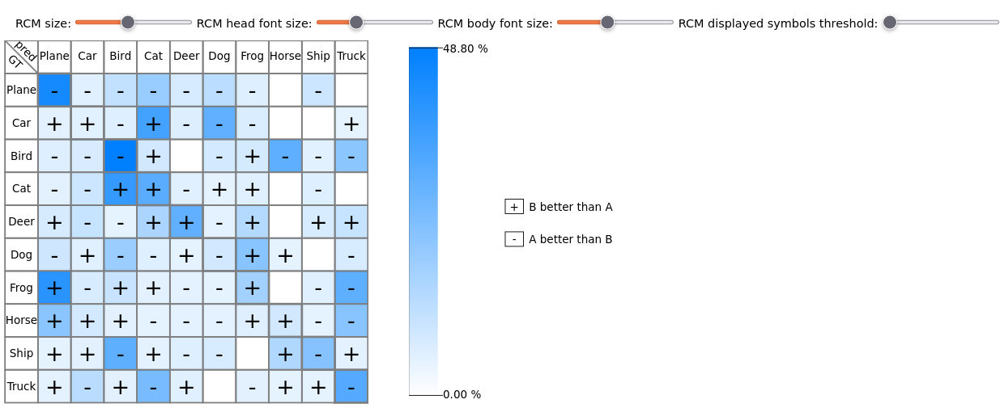

# RCM

Implementation of RCM: Relative Confusion Matrix

Illustration of the tool to display a RCM from two confusion matrices. 



# Description

This code provides an implementation of the RCM to compare two classification models (A and B) on the class-performance level. 
In particular, the visualization highlights the differences between two models. 

The design is inspired from standard confusion matrices: 
- Rows denote ground truth labels.
- Columns denote prediction labels.
- Each cell encodes the difference cell-by-cell between two standard confusion matrices. 
- A $+$ symbol means model B performs better than model A in that cell. 
- A $-$ symbol means model A performs better than model B in that cell. 
- The absence of symbols indicates A and B classify the same number of samples in that cell. 
- A gradient of colors encodes the amount of difference between A and B in that cell.
- Hovering the cells will indicate the exact difference in the number of samples between the two models, alongside the percentage of samples it represents compared to the number of samples of that class (w.r.t. to the ground truths).  

The tool is composed of several sliders to control the rendering of the visualization. In particular, the sliders respectively control: 
1. The size of the RCM.
2. The font size of the RCM headers.
3. The font size of the symbols in the matrix.
4. The percentage of symbols displayed in the matrix.

The last slider enables the user to hide some symbols to highlight the cells with the greatest differences between the two models. 

## The repository is composed of: 
- The rendering HTML file to visualize the RCM: [index.html](index.html)
- The JS implementation of RCM: [rcm.js](rcm.js)
- A JS file in which two variables (A and B) store the two standard confusion matrices as JS lists: [matrices_data.js](matrices_data.js)
- A JS file to control several rendering parameters, such as the list of class labels, the maximum number of charachters the labels can be displayed with, the HTML font_family, etc: [config.js](config.js)
- The code that controls that the standard confusion matrices are well-constructed and compatible with one another: [checker.js](checker.js) and [problems_display.js](problems_display.js)
- A python sample of code to generate examples of standard confusion matrices with density and minimum recall parameters that attempt to mimic realistic models: [matrix_generator.ipynb](matrix_generator.ipynb) 


# Usage

To use this code: 
1. Replace your own matrices A and B in the [matrices_data.js](matrices_data.js) file.
2. (Include the names of your classes in the *classes_name* variable in the [config.js](config.js) file)

> ⚠️ **_NOTE:_** This code has not been tested with more than 30 classes. 

> ⚠️ **_NOTE:_** When generating matrices using the generator [matrix_generator.ipynb](matrix_generator.ipynb), an error can be thrown sometimes: "ValueError: low >= high". If that error happens, generating another matrix a couple of times should solve the problem. 


# Reference

If you use this code, please cite either one of these two works: 

```
POMMÉ, Luc-Etienne, BOURQUI, Romain, GIOT, Romain, et al. Relative confusion matrix: efficient comparison of decision models. In : 2022 26th International Conference Information Visualisation (IV). IEEE, 2022. p. 98-103.
```

```
POMMÉ, Luc Etienne, BOURQUI, Romain, GIOT, Romain, et al. Relative Confusion Matrix: An Efficient Visualization for the Comparison of Classification Models. In : Artificial Intelligence and Visualization: Advancing Visual Knowledge Discovery. Cham : Springer Nature Switzerland, 2024. p. 223-243.
```